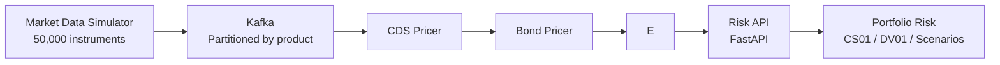

# credit-risk-engine

A production-scale real-time credit risk engine designed to price and aggregate risk across tens of thousands of CDS and bond positions simultaneously.

## Architecture


## Stack
- **Streaming**: Kafka - market data partitioned by product type
- **Pricing**: Python - CDS ISDA standard model, bond analytics
- **Cache**: Redis - real-time risk results at scale
- **API**: FastAPI - portfolio Greeks on demand
- **Infra**: Docker, Kubernetes, AWS

## Modules
| Module | Status | Description |
|--------|--------|-------------|
| `src/pricing/cds.py` | 🔧 In progress | Hazard rates, risky annuity, upfront, CS01 |
| `src/pricing/bond.py` | 🔧 In progress | Clean price, DV01, Z-spread |
| `src/streaming/` | 🔧 In progress | Kafka producer/consumer |
| `src/api/` | 🔧 In progress | FastAPI risk endpoint |
| `infra/` | ⏳ Planned | Docker, Kubernetes, AWS |

## Quickstart
```bash
git clone https://github.com/jppapper/credit-risk-engine.git
cd credit-risk-engine
python -m venv venv && venv\Scripts\activate
pip install -r requirements.txt
cp .env.example .env
```

