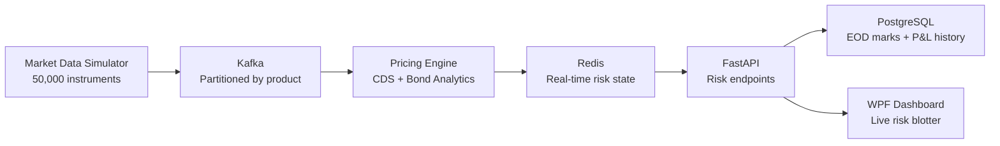

# credit-risk-engine

A production-scale distributed credit risk platform built from scratch using modern event-driven architecture. Prices and aggregates risk across tens of thousands of CDS and bond positions in real time.

## Architecture


## Stack
- **Streaming**: Kafka — market data partitioned by product type
- **Pricing**: Python — CDS ISDA standard model, bond analytics
- **Cache**: Redis — real-time risk results at sub-millisecond latency
- **API**: FastAPI — portfolio Greeks and position data on demand
- **Database**: PostgreSQL — EOD marks and historical P&L
- **Dashboard**: C# WPF — native Windows desktop blotter consuming FastAPI endpoints in real time
- **Infra**: Docker, Kubernetes, AWS EKS
- **Languages**: Python, C#, SQL

## Analytics Suite
| Instrument | Metrics |
|------------|---------|
| CDS | CS01, IR01, upfront price, carry, jump-to-default |
| Bond | DV01, clean/dirty price, YTM, Z-spread, convexity, carry |

## Modules
| Module | Status | Description |
|--------|--------|-------------|
| `src/pricing/cds.py` | ✅ Complete | Hazard rates, risky annuity, upfront, CS01 |
| `src/pricing/bond.py` | ✅ Complete | Clean price, DV01, Z-spread, convexity |
| `src/streaming/` | ✅ Complete | Kafka producer/consumer |
| `src/api/` | ✅ Complete | FastAPI risk endpoints |
| `src/database/` | ✅ Complete | PostgreSQL EOD marks |
| `src/dashboard/` | ✅ Complete | WPF C# live risk blotter |
| `infra/` | ✅ Complete | Docker, Kubernetes, AWS EKS |

## Quickstart
```bash
git clone https://github.com/jppapper/credit-risk-engine.git
cd credit-risk-engine
python -m venv venv && venv\Scripts\activate
pip install -r requirements.txt
cp .env.example .env
docker-compose up
```